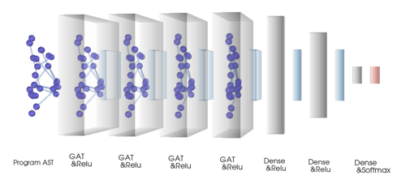

# GNNProgramTermination
Using Graph Neural Networks for Program Termination




## Run locally

#### Setup virtual environment

If not installed, install python virtual environment : 
```
pip install virtualenv 
```

Create virtual environment with directory gnnEnv
```
python3 -m venv gnnEnv
```

activate virtual environment
```
source gnnEnv/bin/activate
```

load required dependencies to virtual environment
```
python3 -m pip install -r requirements.txt
```

#### Training
```
python3 train.py
```


#### Evaluate pretrained models 
```
python3 test.py
```

